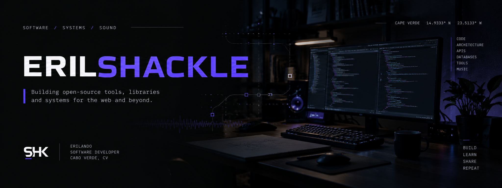

 

### Software & Web Developer · Backend · Systems & Architecture

Building **web applications**, **backend systems**, **open-source libraries** and **developer tools**.

 

 

## `./projects`

<table>
<tr>
<td width="50%" valign="top">

### 📅 Calendary

**Scheduling primitives for PHP.**

Availability, busy periods and bookable time slots with a small, framework-agnostic API.

[Repository](https://github.com/eril/calendary) · [Packagist](https://packagist.org/packages/eril/calendary)

</td>
<td width="50%" valign="top">

### 💳 Vinti4Net

**Payments for Cabo Verde, from PHP.**

SDK for integrating PHP applications with the SISP / Rede Vinti4 payment infrastructure.

[Packagist](https://packagist.org/packages/erilshk/vinti4net)

</td>
</tr>

<tr>
<td width="50%" valign="top">

### 🗃️ Migraw

**Database migrations without the ceremony.**

Lightweight migration tooling with history, baselines, squash workflows and multiple database drivers.

`PHP` `CLI` `Database` `Migrations`

</td>
<td width="50%" valign="top">

### ⚙️ Peshk

**A playground for PHP architecture.**

Routing, middleware, rendering, APIs, persistence, security and CLI tooling.

`PHP` `Architecture` `Web` `Tooling`

</td>
</tr>
</table>

 

## `./stack`

### Languages

### Frameworks & Web

### Data & Tools

 

## `./activity`

  

 

---

`build → break → understand → improve`

  

Open to **open-source collaboration** and interesting software projects.

  

